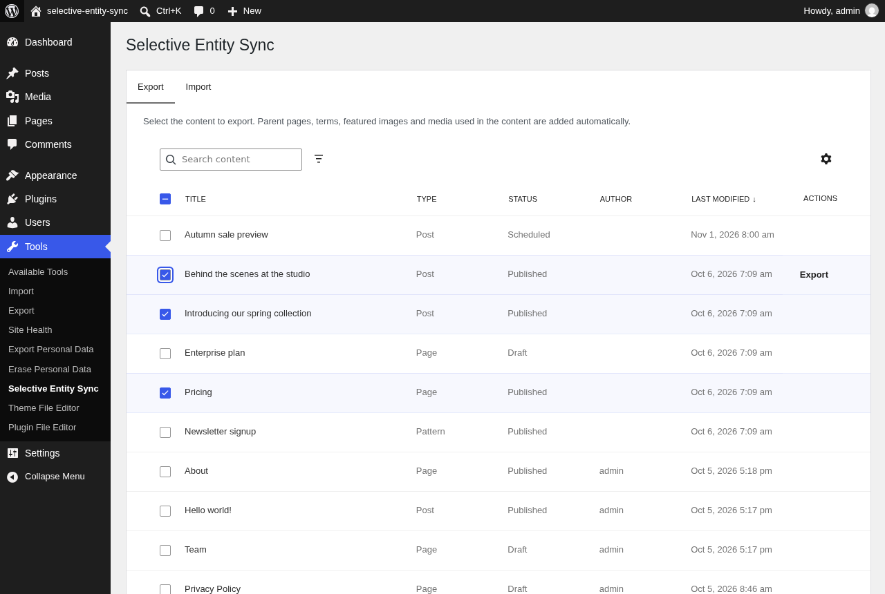
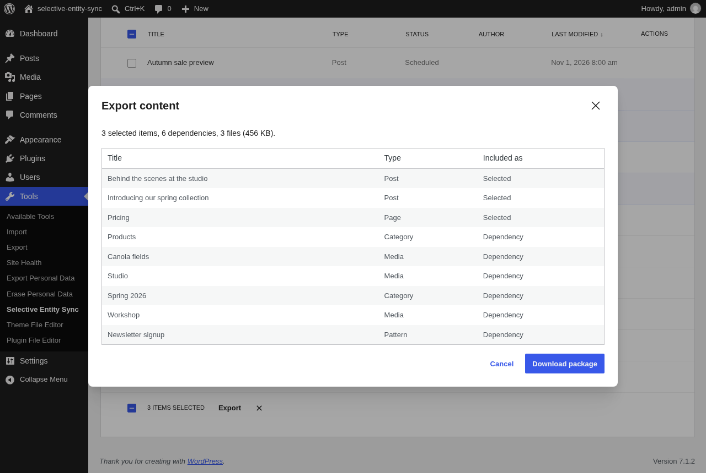
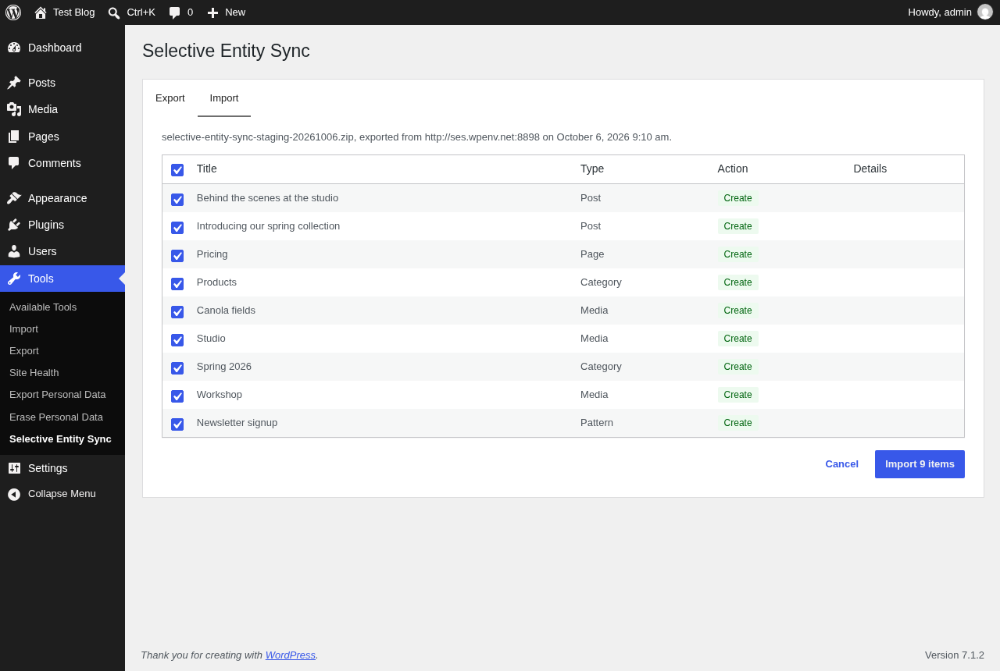
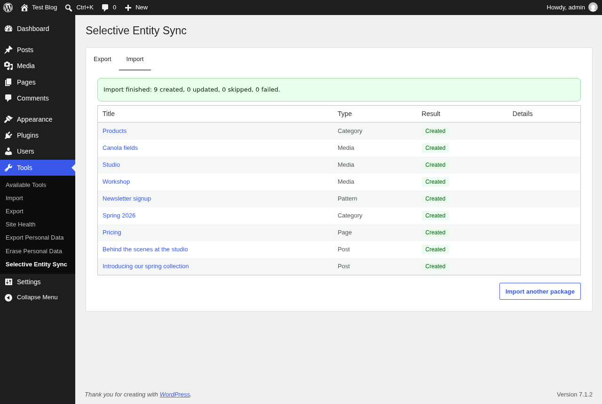

# Selective Entity Sync

> Push **specific content** from one WordPress environment to another without overwriting the target's live data.

Selective Entity Sync is a WordPress plugin for moving content changes safely between two WordPress sites, such as staging → production, production → staging, or between two live sites. It doesn't migrate the whole database, or whole tables, which would wipe out the orders, user accounts and form entries created on the target site since your last sync. Instead it exports the exact **entities** you pick (posts, pages, custom post types, terms, media) into a portable manifest, and imports them on the target site, **remapping every database ID** along the way.

> **Status:** early release (0.1.1). Try it on a staging copy before relying on it in production.

---

## Table of contents

- [Why](#why)
- [How it works](#how-it-works)
- [What gets synced](#what-gets-synced)
- [Screenshots](#screenshots)
- [Limitations](#limitations)
- [Security](#security)
- [Requirements](#requirements)
- [Installation](#installation)
- [Usage](#usage)
- [Hooks reference](#hooks-reference)
- [Roadmap to launch](#roadmap-to-launch)
- [Development](#development)
- [License](#license)

## Why

Many teams prepare content on one environment, often a staging site, and then need it on another. If they move it by copying the database, then on any site with live activity (WooCommerce, memberships, forms, comments) they have to choose between:

- **overwriting the target's data** created since the last sync, or
- **re-creating the content by hand** on the target.

Selective Entity Sync is built for that kind of workflow. Staging → production is the most common case, but it works between **any two WordPress sites**: pulling a fixed-up page back down to staging, sharing content between sister sites, or seeding a new environment.

Table-level migration tools narrow the problem but don't solve it. A post's featured image, parent page, terms and the image IDs inside its blocks all point to auto-increment IDs that differ between sites.

Selective Entity Sync moves only what you choose, and fixes up those references on arrival.

## How it works

1. **Select.** On the source site, pick the posts/pages/CPT entries to sync from **Tools → Selective Entity Sync → Export**.
2. **Resolve dependencies.** The plugin follows references from your selection: parent posts, terms and their ancestors, featured images, media and synced patterns used inside content, and ID-bearing meta. Dependencies are bundled automatically (see [`selective_entity_sync_include_dependency`](#selective_entity_sync_include_dependency) to change that).
3. **Export.** You download a `.zip` package containing a versioned `manifest.json` and the media files.
4. **Preview.** On the target site, upload the package under **Import**. A dry run shows what will be **created**, **updated** or **skipped**, before anything is written.
5. **Import.**
   - Entities are matched to existing content by a stable **UUID** stored on each entity. If there's no UUID match, they're matched by a natural key (post type + slug, taxonomy + slug, file hash).
   - New entities get new IDs.
   - Every reference (post parent, `_thumbnail_id`, term parents, block attributes such as `id`/`ids`/`mediaId`, `wp-image-N` classes, `[gallery ids]`) is **rewritten** to the target site's IDs.

Content that isn't in the manifest is never touched.

## What gets synced

| Entity | Included |
|---|---|
| Posts, pages, custom post types, synced patterns | Content, excerpt, status (drafts, scheduled and private included; never trash), dates, slug, post meta, parent/child relations, menu order, sticky flag |
| Taxonomies and terms | Name, slug, description, hierarchy, term meta, post ↔ term relations |
| Media attachments | The file itself, title/caption/alt text, attachment meta. Image sizes are regenerated on the target |
| Authors | Mapped to an existing user by login/email (users are never created). Falls back to the importing user |

## Screenshots

| | |
|---|---|
|  |  |
| **Export:** search, filter and select content. | **Export preview:** dependencies are added automatically. |
|  |  |
| **Import preview:** untick anything you want to keep unchanged. | **Import report:** links to every imported item. |

## Limitations

- **No ACF support** yet. ACF fields that store plain values are synced as post meta, but relational ACF fields (post object, relationship, image, gallery) aren't remapped.
- **No direct site-to-site push.** Packages are transferred as files.
- **File types must be allowed on the target.** Media whose type the target doesn't accept for uploads (e.g. SVG on a default install) is rejected.
- **Content with the same slug is treated as the same item** when it has never been synced (see [`selective_entity_sync_match_existing_entity`](#selective_entity_sync_match_existing_entity) to disable this).
- **Links to other pages** are rewritten from the source domain to the target domain, but not remapped to different slugs.
- **Users, comments, orders and other non-content data are intentionally never synced**, and neither are site settings, menus, templates or global styles.
- **Multisite hasn't been tested yet.** Each site can export and import packages, but syncing directly between sites of the same network isn't supported.
- Imports from the admin run in batches (see [`selective_entity_sync_import_batch_limits`](#selective_entity_sync_import_batch_limits)), but the package must still fit PHP's upload limit (`upload_max_filesize`, `post_max_size`). For very large packages, use WP-CLI.
- The Export table's selection applies to the current page of results (use up to 100 items per page).

## Security

- **Who can sync.** Only users with `manage_options` (administrators) by default; see [`selective_entity_sync_capability`](#selective_entity_sync_capability). If you lower it, per-item WordPress permissions still apply. Users can only export content they can read, and only import what they could create or edit by hand. That covers creating each content type, publishing, attributing content to other users, managing terms and uploading media. WP-CLI runs are trusted, like WordPress's own CLI commands.
- **Only import packages you trust.** A package is content from another site. Imported content goes through WordPress's usual filtering for users without the `unfiltered_html` capability (e.g. multisite administrators). Only content types can be written: never templates, global styles, navigation menus or other site configuration.
- **Uploaded packages** are checked before anything is extracted:
  - size and file-count limits;
  - only the files listed in the manifest, with safe paths;
  - file types WordPress allows for uploads;
  - checksums.

  Between upload and import they're kept in `wp-content/uploads/selective-entity-sync-packages/` with random names, and are only accessible to the uploader. They're deleted after import, on cancel, or after a day. The folder blocks web access with an `.htaccess` file, which only Apache honours. **On nginx**, add:

  ```nginx
  location ^~ /wp-content/uploads/selective-entity-sync-packages/ {
  	deny all;
  }
  ```

- **Temporary files** (packages being built or extracted) live in the system temp directory, readable only by the web server's user, and are cleaned up daily.
- **Uninstalling** removes temporary files and pending uploads. Imported content, and the UUIDs that link it across sites, are kept.

Found a vulnerability? Please report it privately to the maintainer rather than opening a public issue.

## Requirements

- WordPress **6.9** or later
- PHP **7.4** or later
- The PHP `zip` extension (`ZipArchive`)

## Installation

1. Download the latest `selective-entity-sync.zip` from the [Releases](https://github.com/gabriel-detassigny/selective-entity-sync/releases) page.
2. In WordPress, go to **Plugins → Add New → Upload Plugin** and upload the zip.
3. Activate the plugin on **both** the source and the target site.

## Usage

### Admin

**Tools → Selective Entity Sync** has two tabs:

- **Export**: search and filter your content (by type and status), select entries, then use **Export** to review what will be included (selected items, dependencies added automatically, files and their size, warnings) and download the package.
- **Import** (large packages are processed in batches, with a progress bar): upload a package and review the preview: each item is marked **Create** or **Update** (with how it was matched, e.g. "Previously synced" or "Same slug"), and you can untick anything you don't want to change. Then import and read the result report, with links to every imported item.

By default only users with the `manage_options` capability can access the screen. See [`selective_entity_sync_capability`](#selective_entity_sync_capability).

### WP-CLI

```bash
# See what an export would contain (selection + dependencies), without writing anything.
wp selective-entity-sync export --post_ids=12,34 --dry-run

# Export to a package.
wp selective-entity-sync export --post_ids=12,34 --file=/tmp/sync.zip

# Preview an import: what would be created, updated, skipped, linked or missing.
wp selective-entity-sync import /tmp/sync.zip --dry-run

# Import, as an administrator so content isn't filtered.
wp selective-entity-sync import /tmp/sync.zip --user=admin

# Leave some entities untouched.
wp selective-entity-sync import /tmp/sync.zip --user=admin --skip=<uuid>,<uuid>
```

Run imports with `--user=<administrator>`. Without a user, WordPress filters imported content the way it does for untrusted authors (scripts, iframes and similar markup are removed).

### REST API

All routes live under `/wp-json/selective-entity-sync/v1` and need the capability returned by [`selective_entity_sync_capability`](#selective_entity_sync_capability).

| Route | Description |
|---|---|
| `GET /entities` | Content that can be selected for export. Parameters: `search`, `post_type`, `status`, `page`, `per_page` (max 100), `orderby` (`modified`, `date`, `title`), `order`. |
| `GET /export/options` | Exportable post types and statuses, with labels. |
| `POST /export/preview` | `{ "post_ids": [12, 34] }`: what the export would contain (entities, files, warnings). |
| `POST /export` | `{ "post_ids": [12, 34] }`: responds with the package zip file. |
| `POST /import/packages` | Multipart upload (field `package`): stores the package and returns a `token` with the import plan. |
| `GET /import/packages/{token}` | The import plan of an uploaded package. |
| `POST /import/packages/{token}/import` | `{ "skip": ["<uuid>"] }`: starts the import and runs the first batch. Returns `{ done, processed, total }`, plus `report` once done. |
| `POST /import/packages/{token}/import/next` | Runs the next batch. Call it until `done` is `true`; the package is deleted afterwards. |
| `DELETE /import/packages/{token}` | Discards an uploaded package. |

Uploaded packages are only visible to the user who uploaded them and expire after a day (see [`selective_entity_sync_temp_file_lifetime`](#selective_entity_sync_temp_file_lifetime)).

## Hooks reference

Selective Entity Sync is built to be extended. All hooks are prefixed `selective_entity_sync_`. Add your code to a small custom plugin or mu-plugin.

### Actions

#### `selective_entity_sync_loaded`

Fires once the plugin has registered all of its services. This is the recommended place for add-ons to register their integrations.

| Parameter | Type | Description |
|---|---|---|
| `$plugin` | `SelectiveEntitySync\Plugin` | The plugin instance. |

Since `0.1.0`.

```php
add_action( 'selective_entity_sync_loaded', function ( $plugin ) {
	// Register custom collectors, handlers or rewriters here.
} );
```

#### `selective_entity_sync_before_export`

Fires before an export package is built.

| Parameter | Type | Description |
|---|---|---|
| `$post_ids` | `int[]` | Selected post IDs. |

Since `0.1.0`.

```php
add_action( 'selective_entity_sync_before_export', function ( array $post_ids ) {
	error_log( 'Exporting ' . count( $post_ids ) . ' items.' );
} );
```

#### `selective_entity_sync_after_export`

Fires after an export package has been written, before it's delivered.

| Parameter | Type | Description |
|---|---|---|
| `$result` | `SelectiveEntitySync\Export\ExportResult` | The manifest, package path and plan. |

Since `0.1.0`.

```php
add_action( 'selective_entity_sync_after_export', function ( $result ) {
	copy( $result->get_package_path(), WP_CONTENT_DIR . '/sync-archive/' . time() . '.zip' );
} );
```

#### `selective_entity_sync_before_import`

Fires before a package is imported.

| Parameter | Type | Description |
|---|---|---|
| `$manifest` | `SelectiveEntitySync\Manifest\Manifest` | The manifest being imported. |

Since `0.1.0`.

```php
add_action( 'selective_entity_sync_before_import', function ( $manifest ) {
	error_log( 'Importing from ' . $manifest->get_source()['site_url'] );
} );
```

#### `selective_entity_sync_entity_imported`

Fires after an entity has been written.

| Parameter | Type | Description |
|---|---|---|
| `$entity` | `array` | Manifest entity. |
| `$local_id` | `int` | Local post or term ID. |
| `$result` | `string` | `created` or `updated`. |

Since `0.1.0`.

```php
add_action( 'selective_entity_sync_entity_imported', function ( array $entity, int $local_id, string $result ) {
	if ( 'post' === $entity['type'] ) {
		clean_post_cache( $local_id );
	}
}, 10, 3 );
```

#### `selective_entity_sync_import_failed`

Fires when an entity fails to import. The import carries on with the other entities.

| Parameter | Type | Description |
|---|---|---|
| `$entity` | `array` | Manifest entity. |
| `$message` | `string` | Error message (plain text). |

Since `0.1.0`.

```php
add_action( 'selective_entity_sync_import_failed', function ( array $entity, string $message ) {
	error_log( "Import of {$entity['uuid']} failed: {$message}" );
}, 10, 2 );
```

#### `selective_entity_sync_after_import`

Fires after a package has been imported.

| Parameter | Type | Description |
|---|---|---|
| `$report` | `SelectiveEntitySync\Import\ImportReport` | What happened to each entity (`get_items()`, `get_counts()`, `has_failures()`). |
| `$manifest` | `SelectiveEntitySync\Manifest\Manifest` | The imported manifest. |

Since `0.1.0`.

```php
add_action( 'selective_entity_sync_after_import', function ( $report ) {
	if ( $report->has_failures() ) {
		wp_mail( get_option( 'admin_email' ), 'Content sync finished with errors', print_r( $report->get_counts(), true ) );
	}
} );
```

### Filters

#### `selective_entity_sync_capability`

Filters the capability required to export and import content (admin screen and REST API). Invalid values fall back to the default.

| Parameter | Type | Description |
|---|---|---|
| `$capability` | `string` | Capability name. Default `manage_options`. |

Since `0.1.0`.

```php
// Let editors sync content.
add_filter( 'selective_entity_sync_capability', function () {
	return 'edit_others_posts';
} );
```

#### `selective_entity_sync_manifest_data`

Filters the manifest data just before it's written to a package. Use it to add custom data to entities or to the manifest. The `files` list is managed by the plugin, so changes to it are ignored, and the result must still be a valid manifest.

| Parameter | Type | Description |
|---|---|---|
| `$data` | `array` | Manifest data: `schema_version`, `generator`, `source`, `entities`, `files`. |
| `$manifest` | `SelectiveEntitySync\Manifest\Manifest` | The manifest being written. |

Since `0.1.0`.

```php
add_filter( 'selective_entity_sync_manifest_data', function ( array $data ) {
	foreach ( $data['entities'] as &$entity ) {
		$entity['data']['exported_by'] = 'deploy-bot';
	}
	return $data;
} );
```

#### `selective_entity_sync_package_limits`

Filters the limits enforced when reading an uploaded package. Invalid or non-positive values fall back to the defaults.

| Parameter | Type | Description |
|---|---|---|
| `$limits` | `array` | `max_package_size` (bytes, default 512 MB), `max_manifest_size` (bytes, default 64 MB), `max_entries` (files in the zip, default 20000), `max_uncompressed_size` (bytes, default 2 GB). |

Since `0.1.0`.

```php
add_filter( 'selective_entity_sync_package_limits', function ( array $limits ) {
	$limits['max_package_size'] = 2 * GB_IN_BYTES;
	return $limits;
} );
```

#### `selective_entity_sync_temp_file_lifetime`

Filters how long temporary working directories (packages being built or extracted) are kept before the daily cleanup deletes them.

| Parameter | Type | Description |
|---|---|---|
| `$lifetime` | `int` | Lifetime in seconds. Default `DAY_IN_SECONDS`. |

Since `0.1.0`.

```php
add_filter( 'selective_entity_sync_temp_file_lifetime', function () {
	return 6 * HOUR_IN_SECONDS;
} );
```

#### `selective_entity_sync_exportable_post_types`

Filters the post types whose content can be selected for export. Attachments are exported as dependencies of the content that uses them, so they aren't selectable.

| Parameter | Type | Description |
|---|---|---|
| `$post_types` | `string[]` | Default: post types with an admin UI, minus templates, template parts, navigation, global styles and fonts. |

Since `0.1.0`.

```php
add_filter( 'selective_entity_sync_exportable_post_types', function ( array $post_types ) {
	return array_diff( $post_types, array( 'product' ) );
} );
```

#### `selective_entity_sync_exportable_statuses`

Filters the post statuses that can be exported. `trash` and `auto-draft` are always removed.

| Parameter | Type | Description |
|---|---|---|
| `$statuses` | `string[]` | Default: `publish`, `future`, `draft`, `pending`, `private`. |

Since `0.1.0`.

```php
add_filter( 'selective_entity_sync_exportable_statuses', function () {
	return array( 'publish' );
} );
```

#### `selective_entity_sync_exportable_taxonomies`

Filters the taxonomies whose terms are exported with posts of a given type.

| Parameter | Type | Description |
|---|---|---|
| `$taxonomies` | `string[]` | Default: all taxonomies registered for the post type. |
| `$post_type` | `string` | Post type name. |

Since `0.1.0`.

```php
add_filter( 'selective_entity_sync_exportable_taxonomies', function ( array $taxonomies ) {
	return array_diff( $taxonomies, array( 'post_format' ) );
} );
```

#### `selective_entity_sync_excluded_meta_keys`

Filters the meta keys that are never exported. The plugin's own UUID key is always excluded.

| Parameter | Type | Description |
|---|---|---|
| `$keys` | `string[]` | Default for posts: `_edit_lock`, `_edit_last`, `_wp_old_slug`, `_wp_old_date`, trash bookkeeping keys, and the attachment file keys (`_wp_attached_file`, `_wp_attachment_metadata`, `_wp_attachment_backup_sizes`). None for terms. |
| `$object_type` | `string` | `post` (including attachments) or `term`. |

Since `0.1.0`.

```php
add_filter( 'selective_entity_sync_excluded_meta_keys', function ( array $keys, string $object_type ) {
	if ( 'post' === $object_type ) {
		$keys[] = '_my_plugin_cache';
	}
	return $keys;
}, 10, 2 );
```

#### `selective_entity_sync_id_reference_meta_keys`

Filters the meta keys whose values are IDs of other posts or terms. The referenced entities are exported as dependencies, and the IDs are remapped to the target site's IDs on import. A value may be a single ID, a comma-separated list or an array of IDs.

| Parameter | Type | Description |
|---|---|---|
| `$keys` | `array<string, string>` | Meta key => referenced object type (`post` or `term`). Default: `_thumbnail_id` => `post`. |
| `$object_type` | `string` | Object type owning the meta: `post` or `term`. |

Since `0.1.0`.

```php
add_filter( 'selective_entity_sync_id_reference_meta_keys', function ( array $keys, string $object_type ) {
	if ( 'post' === $object_type ) {
		$keys['related_posts'] = 'post';
		$keys['hero_image_id'] = 'post';
	}
	return $keys;
}, 10, 2 );
```

#### `selective_entity_sync_block_reference_attributes`

Filters which block attributes hold IDs of other posts (media, synced patterns, …). Referenced posts are exported as dependencies, and the attribute values are remapped on import.

| Parameter | Type | Description |
|---|---|---|
| `$map` | `array<string, string[]>` | Block name => attribute names. Default covers `core/image`, `core/gallery`, `core/cover`, `core/media-text`, `core/video`, `core/audio`, `core/file` and `core/block`. |

Since `0.1.0`.

```php
add_filter( 'selective_entity_sync_block_reference_attributes', function ( array $map ) {
	$map['acme/hero'] = array( 'imageId', 'galleryIds' );
	return $map;
} );
```

#### `selective_entity_sync_include_dependency`

Filters whether a dependency is bundled in the package or only referenced. Reference-only entities are matched on the target site but never created there.

| Parameter | Type | Description |
|---|---|---|
| `$include` | `bool` | Default `true`. |
| `$dependency` | `SelectiveEntitySync\Export\EntityReference` | The dependency (`get_object_type()`, `get_id()`). |
| `$required_by` | `SelectiveEntitySync\Export\EntityReference\|null` | The entity that first required it. |

Since `0.1.0`.

```php
// Never bundle terms: expect them to exist on the target already.
add_filter( 'selective_entity_sync_include_dependency', function ( bool $bundle, $dependency ) {
	return 'term' === $dependency->get_object_type() ? false : $bundle;
}, 10, 2 );
```

#### `selective_entity_sync_export_entity_data`

Filters an entity before it's added to the export manifest. The entity must keep its `uuid`, `type`, `source_id` and `data` keys.

| Parameter | Type | Description |
|---|---|---|
| `$entity` | `array` | Entity data: `uuid`, `type`, `source_id`, `data`, and depending on the type `relations`, `meta`, `file`. |
| `$reference` | `SelectiveEntitySync\Export\EntityReference` | Local object the entity was built from. |

Since `0.1.0`.

```php
add_filter( 'selective_entity_sync_export_entity_data', function ( array $entity ) {
	unset( $entity['meta']['_internal_notes'] );
	return $entity;
} );
```

#### `selective_entity_sync_collectors`

Filters the entity collectors used to export content. The first collector whose `supports()` returns true handles an entity, so prepend custom collectors to override the defaults. Collectors implement `SelectiveEntitySync\Export\Collectors\EntityCollector`.

| Parameter | Type | Description |
|---|---|---|
| `$collectors` | `EntityCollector[]` | Default: post, attachment and term collectors. |

Since `0.1.0`.

```php
add_filter( 'selective_entity_sync_collectors', function ( array $collectors ) {
	array_unshift( $collectors, new My_Product_Collector() );
	return $collectors;
} );
```

#### `selective_entity_sync_import_handlers`

Filters the handlers used to import entities. The first handler whose `supports()` returns true imports an entity, so prepend custom handlers to override the defaults. Handlers implement `SelectiveEntitySync\Import\Handlers\ImportHandler`.

| Parameter | Type | Description |
|---|---|---|
| `$handlers` | `ImportHandler[]` | Default: post, attachment and term handlers. |

Since `0.1.0`.

```php
add_filter( 'selective_entity_sync_import_handlers', function ( array $handlers ) {
	array_unshift( $handlers, new My_Product_Import_Handler() );
	return $handlers;
} );
```

#### `selective_entity_sync_match_existing_entity`

Filters the local object an imported entity is matched to. Matching tries the UUID first, then the slug (or the file checksum for media), but only accepts a slug match when the local object has no UUID or the same one.

| Parameter | Type | Description |
|---|---|---|
| `$local_id` | `int\|null` | Matched local ID, or `null`. Return a local ID to force a match, or `null` to import the entity as new. |
| `$entity` | `array` | Manifest entity. |
| `$method` | `string\|null` | How it was matched: `uuid`, `slug`, `file`, or `null`. |

Since `0.1.0`.

```php
// Never link by slug: only UUID matches count.
add_filter( 'selective_entity_sync_match_existing_entity', function ( $local_id, array $entity, $method ) {
	return 'slug' === $method ? null : $local_id;
}, 10, 3 );
```

#### `selective_entity_sync_import_action`

Filters what happens to an entity on import. The admin screen also lets users untick items.

| Parameter | Type | Description |
|---|---|---|
| `$action` | `string` | `create`, `update` or `skip`. Default: `update` when a local match exists, `create` otherwise. |
| `$entity` | `array` | Manifest entity. |
| `$local_id` | `int\|null` | ID of the matched local object, if any. |

Since `0.1.0`.

```php
// Never overwrite pages that already exist on this site.
add_filter( 'selective_entity_sync_import_action', function ( string $action, array $entity ) {
	return 'update' === $action && 'page' === ( $entity['data']['post_type'] ?? '' ) ? 'skip' : $action;
}, 10, 2 );
```

#### `selective_entity_sync_import_entity_data`

Filters an entity just before it's written to this site.

| Parameter | Type | Description |
|---|---|---|
| `$entity` | `array` | Manifest entity. |
| `$local_id` | `int\|null` | Local ID being updated, or `null` when creating. |

Since `0.1.0`.

```php
// Import everything as a draft for review.
add_filter( 'selective_entity_sync_import_entity_data', function ( array $entity ) {
	if ( 'post' === $entity['type'] ) {
		$entity['data']['post_status'] = 'draft';
	}
	return $entity;
} );
```

#### `selective_entity_sync_import_author`

Filters the local user an imported post or media item is attributed to. By default authors are matched by login, then email. Without a match, existing content keeps its author and new content is attributed to the importing user.

| Parameter | Type | Description |
|---|---|---|
| `$user_id` | `int` | Resolved local user ID (0 for none). |
| `$author` | `array\|null` | Exported author info: `login`, `email`, `display_name`. |
| `$current_id` | `int` | Current author of the local post (0 for new content). |

Since `0.1.0`.

```php
add_filter( 'selective_entity_sync_import_author', function ( int $user_id ) {
	return $user_id ?: (int) get_user_by( 'login', 'editorial' )->ID;
} );
```

#### `selective_entity_sync_replace_site_url`

Filters whether the source site's URL is replaced with this site's URL in imported content (post content and excerpts). Media file URLs are always remapped.

| Parameter | Type | Description |
|---|---|---|
| `$replace` | `bool` | Default `true`. |
| `$source_url` | `string` | The source site URL from the package. |

Since `0.1.0`.

```php
add_filter( 'selective_entity_sync_replace_site_url', '__return_false' );
```

#### `selective_entity_sync_import_batch_limits`

Filters how much one import request processes before continuing in the next one. Imports from the admin screen run in batches so large packages stay within PHP's time and memory limits. A batch stops after `max_entities` entities or `max_seconds` seconds, whichever comes first, and always processes at least one entity. WP-CLI imports aren't batched.

| Parameter | Type | Description |
|---|---|---|
| `$limits` | `array` | `max_entities` (default 25) and `max_seconds` (default 15). Invalid or non-positive values fall back to the defaults. |

Since `0.1.0`.

```php
// A host with a 30-second limit and slow image processing.
add_filter( 'selective_entity_sync_import_batch_limits', function ( array $limits ) {
	$limits['max_entities'] = 10;
	$limits['max_seconds']  = 10;
	return $limits;
} );
```

## Roadmap to launch

What's left before the first public release. Items are ticked as they land on `main`.

### Export

- [x] REST endpoint listing selectable content (search, filter by post type and status)
- [x] Dependency resolution: parent posts, terms and their ancestors, featured images, media and synced patterns used in blocks, `wp-image-N` classes and `[gallery]` shortcodes, ID-bearing meta
- [x] Post, term and attachment collectors, with author info exported as login and email (mapped on import)
- [x] Default excluded meta keys (`_edit_lock`, `_edit_last`, `_wp_old_slug`, …), filterable
- [x] Export REST endpoints: preview and package download
- [x] WP-CLI: `wp selective-entity-sync export`

### Import

- [x] Package upload, validation and storage between requests
- [x] Preview (dry run): what will be created, updated or skipped, and why
- [x] Matching existing content by UUID, falling back to natural keys (post type + slug, taxonomy + slug, file hash)
- [x] Ordered import (dependencies first) building a UUID → local ID map
- [x] Reference rewriting: block attributes (`id`, `ids`, `mediaId`, …), `wp-image-N` classes, `[gallery ids]`, `_thumbnail_id`, post and term parents, ID-bearing meta, media URLs, site URL
- [x] Media import: file sideloading, regenerated image sizes, deduplication
- [x] Conflict handling: update by default, skip per item (UI) or by filter
- [x] Batched processing for large packages (admin imports run over several requests with a progress bar)
- [x] Import REST endpoints (upload, preview, run, discard)
- [x] WP-CLI: `wp selective-entity-sync import <file> [--dry-run]`

### Admin UI

- [x] Export tab: DataViews table with search, filters and multi-select, dependency summary, download
- [x] Import tab: upload, preview table, confirmation, progress, result report

### Extensibility

- [x] Export lifecycle hooks (`before_export`, `after_export`)
- [x] Import lifecycle hooks (`before_import`, `after_import`, `entity_imported`, `import_failed`)
- [x] Filterable collector registry (export)
- [x] Filterable import handler registry; block reference map shared by export and import
- [ ] Abilities API integration (WordPress 6.9+) for export, preview and import (optional)

### Quality and maintenance

- [x] Round-trip tests: export, alter the target, import, assert every reference is remapped and unrelated content is untouched (integration test for all reference types, Playwright for the UI flow)
- [x] Automated dependency updates and vulnerability alerts (Dependabot for Composer, npm and GitHub Actions; `composer audit` and `npm audit` in CI)
- [x] Security review of all entry points (REST, uploads, WP-CLI)
- [x] Translation files: `.pot`, French translation (PHP `.mo` + JS `.json`), checked in a French admin; CI keeps the template up to date

### Release

- [x] Finalise docs: `readme.txt` (FAQ, limitations such as ACF and SVG), `CONTRIBUTING.md`, screenshots
- [x] Tag `v0.1.0` and publish the zip to GitHub Releases
- [ ] Make the GitHub repository public
- [ ] Submit to the WordPress.org plugin directory (Plugin Check, review, SVN deployment workflow)

## Development

Requirements: PHP 7.4+, Composer, Node.js 22+ (24 recommended, see `.nvmrc`), and Docker (or Podman with the Docker-compatible socket) for [`wp-env`](https://developer.wordpress.org/block-editor/reference-guides/packages/packages-env/).

```bash
composer install
npm install
npm run build
npm run sites:start         # source site: http://localhost:8898, target site: http://localhost:8897 (admin / password)
npm run demo:source         # optional: realistic content to export on the source site
```

### Local sites

The plugin moves content *between* sites, so the dev setup has two WordPress sites, each with its own database and uploads. A third site is reserved for the automated tests.

| Site | Config | URL | Use it for |
|---|---|---|---|
| **Source** | `.wp-env.json` | http://localhost:8898 | Create or edit content and export it. `npm run demo:source` adds sample pages, posts, media, a synced pattern and nested categories. |
| **Target** | `.wp-env.target.json` | http://localhost:8897 | Import packages exported from the source. Starts empty, like a production site you sync into. |
| Test | `.wp-env.test.json` | http://localhost:8899 | Automated tests only (`npm run test:php`, `npm run test:e2e`). Its database is reset by every PHPUnit run. |

Commands:
- **Start / stop both dev sites:** `npm run sites:start` / `npm run sites:stop`.
- **One site at a time:** `npm run wp-env …` targets the source, `npm run wp-env:target …` the target.
- **WP-CLI on the target:** `npm run wp-env:target -- run cli wp post list`. Always keep the `--` after the script name: without it, npm swallows options such as `--user=admin` and WP-CLI never sees them.
- **WP-CLI exports:** WP-CLI runs in `/var/www/html`, which may not be writable, so pass a path under uploads, e.g. `npm run wp-env -- run cli wp selective-entity-sync export --post_ids=12 --file=wp-content/uploads/export.zip`. The file then appears in the site's `wp-content/uploads/` folder.
- **WP-CLI imports:** `npm run wp-env:target -- run cli wp selective-entity-sync import wp-content/uploads/export.zip --user=admin`. The target has its own uploads folder: copy the zip into it first, or upload it from the admin screen instead.
- **Empty the target:** `npm run wp-env:target -- run cli wp site empty --uploads --yes`.
- **Demo content on the target too:** `npm run demo:target`, e.g. to test updates and slug matching against existing content.

A typical manual test:
1. Export on the source.
2. Import the downloaded zip on the target.
3. Change something on the source, export again and import again: the target should show **Update** and stay free of duplicates.

**Testing batching with a few items:** the target loads a development helper (`dev/mu-plugins/`) that can force small import batches. Add this to the gitignored `.wp-env.target.override.json` and run `npm run wp-env:target start -- --update`:

```json
{
  "config": {
    "SELECTIVE_ENTITY_SYNC_DEV_BATCH_SIZE": 2
  }
}
```

| Task | Command |
|---|---|
| PHP coding standards (WP VIP) | `composer lint` / `composer lint:fix` |
| PHP static analysis | `composer analyse` |
| JS/CSS lint | `npm run lint` |
| PHP unit tests | `composer test:unit` |
| PHP integration tests | `npm run test:php` |
| End-to-end tests | `npm run test:e2e` |
| Translations | `npm run makepot`, `composer updatepo`, `npm run makejson` (see [`AGENTS.md`](AGENTS.md)) |

### Accessing the sites from another machine

If wp-env runs on a VM or remote box, WordPress's default `localhost` URLs won't work from your own browser. Point each dev site at its own hostname in its gitignored override file, then restart it with `--update`:

- **Source:** `.wp-env.override.json`, then `npm run wp-env start -- --update`.
- **Target:** `.wp-env.target.override.json`, then `npm run wp-env:target start -- --update`, with port `8897` and a different hostname such as `mysite-target.wpenv.net`.

```json
{
  "config": {
    "WP_HOME": "http://mysite.wpenv.net:8898",
    "WP_SITEURL": "http://mysite.wpenv.net:8898"
  }
}
```

On the machine running the browser, map the hostnames to the VM's IP in `/etc/hosts`, e.g. `192.168.1.50 mysite.wpenv.net mysite-target.wpenv.net`. `*.wpenv.net` resolves to `127.0.0.1` everywhere else, so WordPress's requests to itself (WP-Cron, REST API) keep working inside the container. Keep the test site on `localhost`, because Playwright runs on the same machine as wp-env. SSH port forwarding (`ssh -L 8898:localhost:8898 -L 8897:localhost:8897 <vm>`) is an alternative that needs no config change.

See [`CONTRIBUTING.md`](CONTRIBUTING.md) for how to contribute; detailed rules for contributors and AI agents live in [`AGENTS.md`](AGENTS.md).

## License

[GPL-2.0-or-later](LICENSE)
